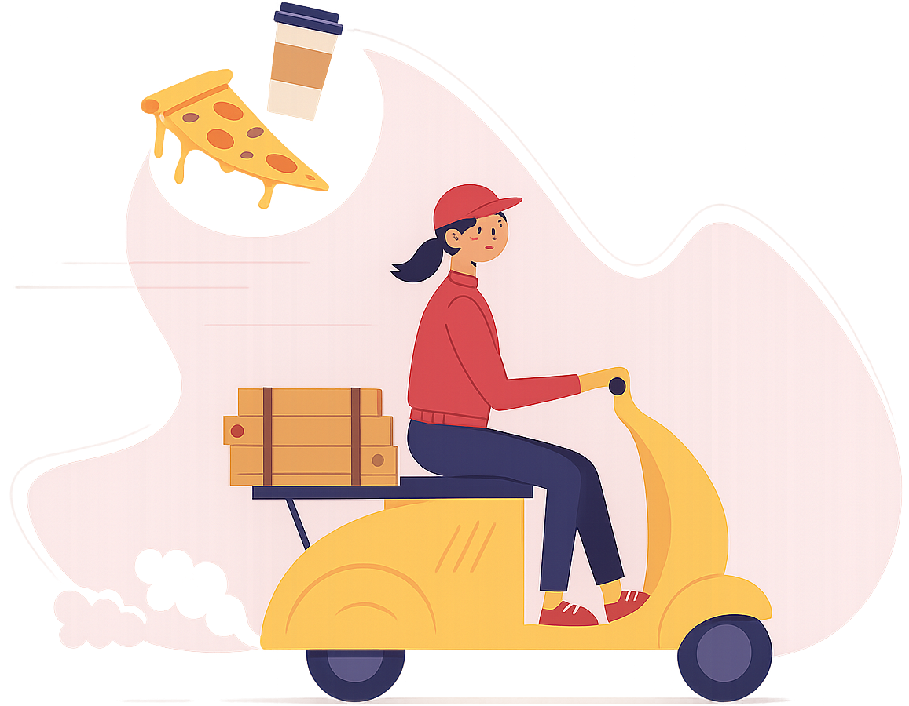
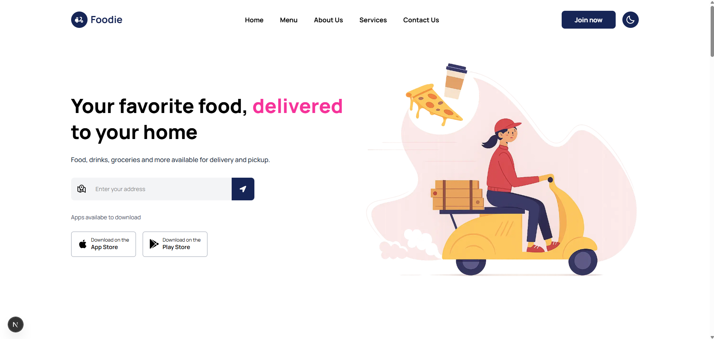
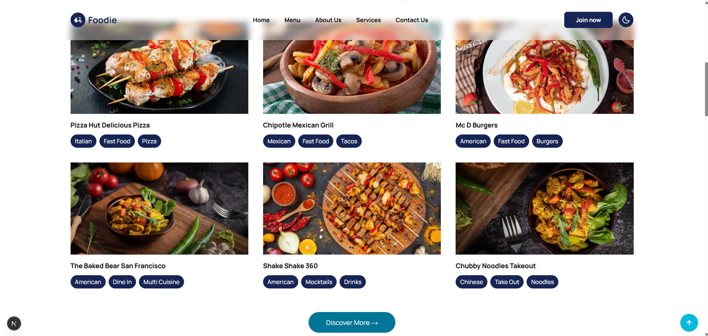

# [🥘 Foodie – Delicious Food Landing Page 🔗](https://foodie-next-landing-page.vercel.app/)




**Foodie** is a modern and responsive landing page for a food delivery service, built with **Next.js**, **Tailwind CSS**, and powered by smooth scroll animations with **AOS**. It's mobile-friendly, theme-toggle-ready, and built for speed and vibe 💨💖

---

## 🔥 Features

- ⚡ **Next.js 15** with fast routing
- 🎨 **Tailwind CSS** for modern styling
- 🌗 **Dark mode** support via `next-themes`
- 🌀 **AOS (Animate on Scroll)** animations
- 📱 Responsive design for all devices
- 🚀 Ready-to-deploy landing layout

---

## 📸 Preview




---

## 🧑‍🍳 Tech Stack

| Tool             | Use                                |
|------------------|-------------------------------------|
| [Next.js](https://nextjs.org/)        | React framework for SSR/SSG         |
| [Tailwind CSS](https://tailwindcss.com/) | Utility-first CSS framework         |
| [AOS](https://michalsnik.github.io/aos/) | Scroll-based animations             |
| [next-themes](https://github.com/pacocoursey/next-themes) | Dark mode and theme toggling       |
| [React Icons](https://react-icons.github.io/react-icons/) | Icon library with multiple sets    |

---

## 📦 Installation

Clone the repo and install dependencies:

```bash
git clone https://github.com/souravcodes1080/foodie.git
```
```
cd foodie
```
```
npm install
```
```
npm run dev
```

# [Access the live demo 👈 🔗](https://foodie-next-landing-page.vercel.app/)